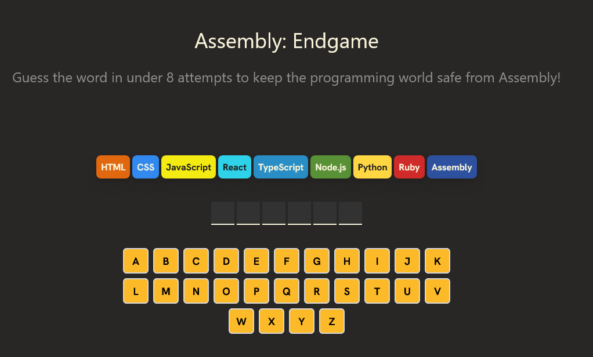

# ⚔️ Assembly: Endgame

**Keep the programming world safe from Assembly!**
A Wordle-style guessing game where every wrong move eliminates a beloved programming language. Run out of chances... and you'll be coding in **Assembly**

## 🔗 Play it here

👉 [lustrous-sfogliatella-513332.netlify.app](https://lustrous-sfogliatella-513332.netlify.app/)

---

## 🎮 How to Play

* You have **8 attempts** to guess the hidden word.
* When you guess:

  * ✅ **Correct letters** will turn **green**.
  * ❌ **Wrong letters** will turn **red**.

---

## 🧠 Tech Stack

* **React** 
* **TypeScript** 
* **Tailwind CSS** 

---

## 🚀 Run Locally

```bash
git clone https://github.com/your-username/assembly-endgame.git
cd assembly-endgame
npm install
npm run dev
```

---

## 📸 Screenshot



---

## 📄 License

it's under the MIT license, have fun

